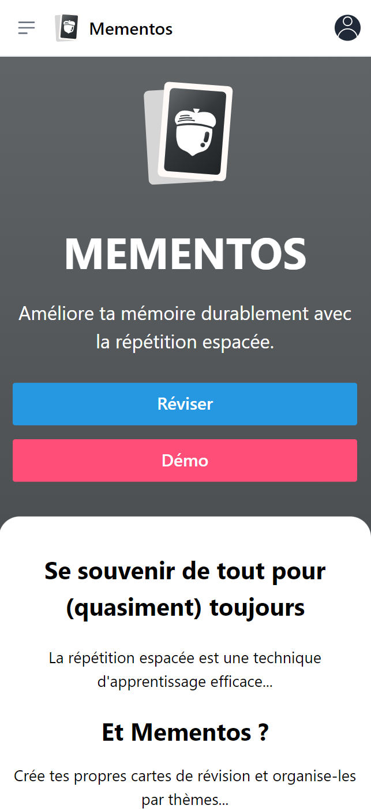
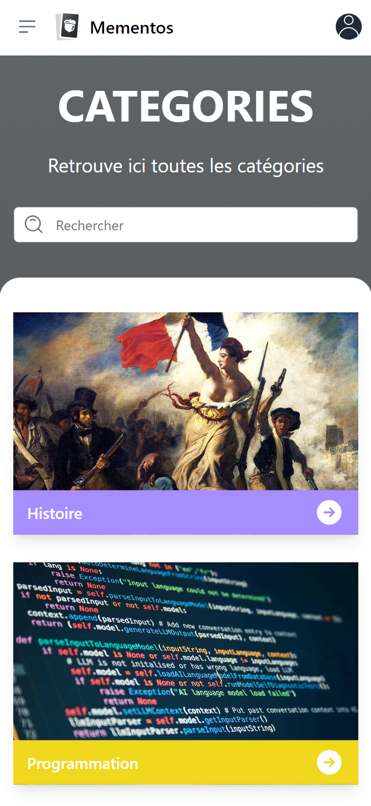
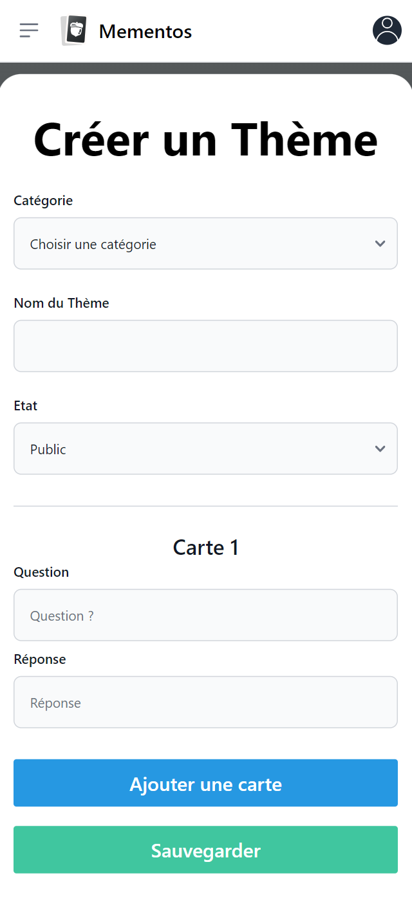
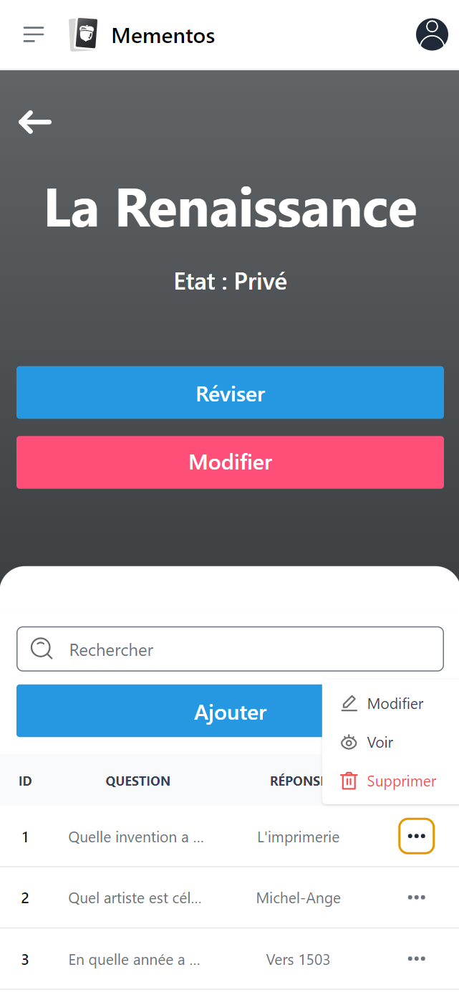

<p align="center"><a href="https://laravel.com" target="_blank"></a></p>

<h1 align="center">MEMENTOS (Frontend)</h1><br>

# Projet de Mémorisation </br> Basée sur la Répétition Espacée🧙‍♂️

L'objectif de ce projet est de concevoir et développer une application de mémorisation basée sur la répétition espacée. Le principe de la répétition espacée est détaillé [ici](https://ncase.me/remember/fr.html).

Cette application permet à l'utilisateur de créer un programme de révision personnalisé. Les utilisateurs choisissent le nombre de cartes à réviser chaque jour selon une formule de progression exponentielle, `2^(N-1)`, où `N` est le niveau de révision des cartes. Par exemple, si un utilisateur commence avec 30 cartes et décide de réviser 20 cartes, et se trompe sur toutes, toutes les cartes restent au niveau 1 pour être révisées à nouveau le lendemain. Le processus de révision ajuste le niveau des cartes en fonction des performances de l'utilisateur, permettant une révision personnalisée et efficace basée sur la méthode de répétition espacée.

## Fonctionnalités 🛠️

- **Inscription et authentification** : Les utilisateurs peuvent s'inscrire et se connecter pour accéder à leurs programmes de révision personnalisés. Une option pour continuer en tant qu'invité est également disponible, permettant l'accès limité aux fonctionnalités sans enregistrement.

- **Création et gestion de thèmes et cartes** : Les utilisateurs peuvent créer des thèmes pour organiser leurs cartes de révision. Chaque thème peut contenir plusieurs cartes, chacune avec une question et une réponse.

- **Duplication de thèmes publics** : Les utilisateurs peuvent dupliquer des thèmes publics créés par d'autres utilisateurs. Cela permet de personnaliser et d'utiliser le contenu existant pour leurs propres révisions.

- **Révision de thèmes** : Les utilisateurs peuvent réviser leurs thèmes ou des thèmes publics. Le système ajuste le niveau de difficulté des cartes en fonction des performances des utilisateurs, utilisant le principe de la répétition espacée.

- **Notifications** : Les utilisateurs peuvent s'abonner aux notifications pour recevoir des rappels concernant leurs sessions de révision programmées.

- **Accessible en mode hors connexion PWA** : En tant que PWA, l'application peut être utilisée sans connexion Internet, permettant aux utilisateurs de réviser leurs cartes n'importe où et à n'importe quel moment.

## Technologies Utilisées 💻

### Frontend

- **Vue.js** : Version 3.4.29

### Backend

- **Laravel** : Version 10.10

- **MySQL** : Version 8.3

- **Mailpit** : Utilisé en développement pour tester l'envoi d'emails sans les envoyer réellement aux utilisateurs finaux.

### Infrastructure

- **Docker** : Utilisé pour conteneuriser l'application, garantissant que l'environnement de développement est répliqué de manière fiable en production.

## Installation et Configuration ⚗️

Suivez ces étapes pour configurer l'environnement de développement de l'application sur votre système local.
### Prérequis 
🐋 Docker Desktop </br>
🟢 Node.js

### Étapes d'Installation

1. **Clonage du dépôt**

   Clonez le dépôt Git en utilisant la commande suivante :

   ```bash
   git clone https://github.com/Mart1n-S/mementos-frontend.git
   cd mementos-frontend
   ```

   ⚠️ Pour tester l'application avec la fonctionnalité <strong>'invité'</strong>, changez pour la branche spécifique en exécutant :

   ```bash
   git checkout userGuest
   ```

2. **Installation des dépendances**

   Installez toutes les dépendances nécessaires à l'aide de npm :

   ```bash
   npm install
   ```

3. **Monter les containers**

   Lancez les containers Docker nécessaires pour le projet avec Docker Compose.

   ```bash
   docker-compose up -d
   ```

## Pour la configuration du backend

> [GitHub mementos-backend](https://github.com/Mart1n-S/mementos-backend)

## Accéder à l'application 🧪

> http://localhost:5173/

## Petit aperçu 👀

<table>
  <tr>
    <td></td>
    <td></td>
  </tr>
  <tr>
    <td></td>
    <td></td>
  </tr>
</table>
